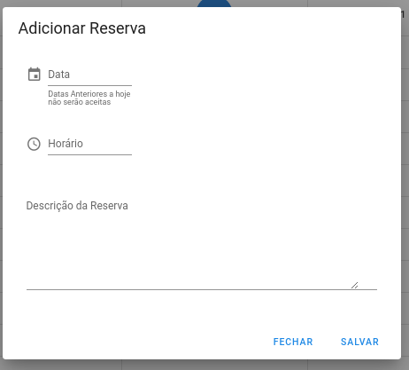

# Reserva de Sala
Esse Projeto foi desenvolvido como teste de contratação para empresa ESL buscando mostrar habilidade tecnicas e um pouco do meu conhecimento em minha carreira como desenvolvedor e estudante.

# Stacks
 
 


# Preview
     


## Configuração do projeto
```
npm install
```

### Compila e recarrega a quente para desenvolvimento
```
npm run serve
```

### Compila e minimiza para produção
```
npm run build
```

